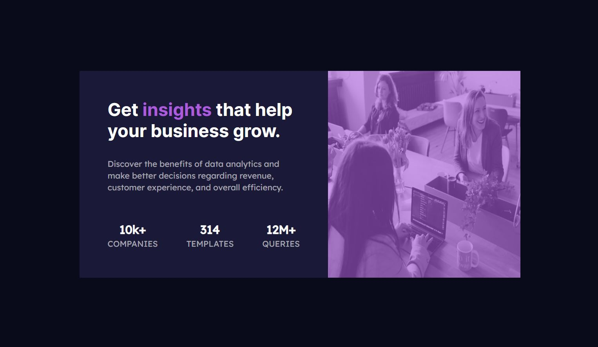

# **Profile card component - Solution**

This is a solution to the [Profile card component challenge on Frontend Mentor](https://www.frontendmentor.io/challenges/profile-card-component-cfArpWshJ)

 

## **Preview**

 

## **Links**

- Live Site URL: [click here]...(ing)

 

## **Built With**

- 
- 
- 

 

## **Tools Used**

- 
- 
- 

 

## **Acknowledgment**

- Challenge by [Frontend Mentor](https://www.frontendmentor.io)

 

 
